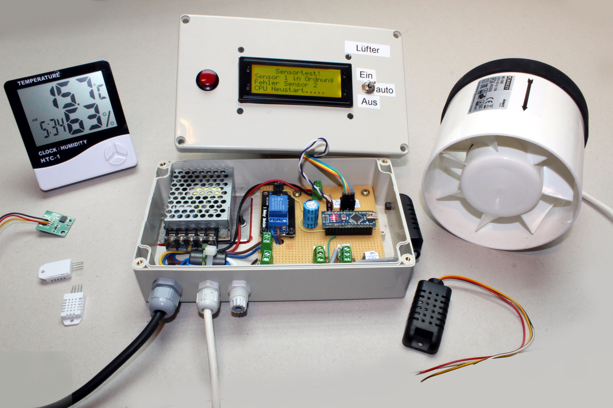
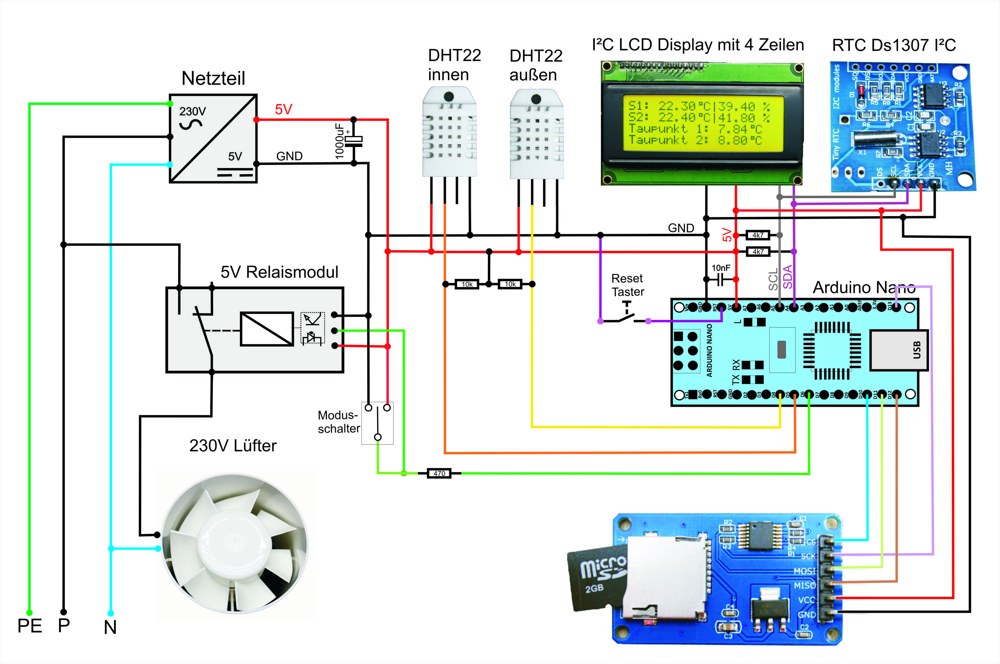

Maker Media GmbH

***

# Taupunktlüfter

**Lüften ist die beste und billigste Maßnahme gegen feuchte Keller  – jedenfalls, wenn man es richtig macht und sich nicht von außen zusätzliche Nässe ins Gewölbe holt. Bei unserem Projekt behält ein Arduino Nano die aktuellen Taupunkte drinnen und draußen rund um die Uhr im Auge und legt durch gezieltes Lüften den Keller trocken.**

Hier gibt es den Arduino-Code zum Projekt des Taupunktlüfters sowohl in der Fassung ohne Datenlogger (Code im Ordner _Taupunkt_Lueftung_), wie in Make 1/22 beschrieben, als auch in der Fassung mit Datenlogger (Code im Ordner _Taupunkt_Lueftung_Datenlogging_Version_2.13_), die in Make 2/22 beschrieben wird. Diese Version zeigt auch der erweiterte Schaltplan:

Der im Schaltplan gezeigte _Modusschalter_ ist ein Schalter mit drei Schaltstellungen: links, Mitte, rechts. In der Mittelstellung sind alle Pole frei, bei rechts wird der mittlere Pol nach rechts verbunden und bei links der mittlere Pol nach links. Beschaltet wird dann beispielsweise so: linker Kontakt des Schalters auf GND (linke Stellung ist dann für **aus**), rechter Kontakt auf VCC (5V, rechte Stellung ist dann für **an**) und Mittelkontakt auf Arduino-IO-Pin 6 (Verbindung zum Relais, Mittelstellung ist dann für **Automatik**).

Die wichtigsten Fragen rund um den Taupunktlüfter beantwortet eine **[FAQ](https://heise.de/-6526328)**. Die vollständigen Artikel zum Projekt gibt es in der **[Make-Ausgabe 1/22 ab Seite 22](https://www.heise.de/select/make/2022/1/2135511212557842576)** und in der **[Make-Ausgabe 2/22 ab Seite 82](https://www.heise.de/select/make/2022/2/2204711461516715363)** zu lesen.

Dank Patrick alias _resipat265_ aus dem heise-Forum gibt es jetzt auch eine Vorlage für den Nachbau auf **[Lochraster-Platine](./Lochraster/Lochraster.md)**. Vielen Dank dafür!
